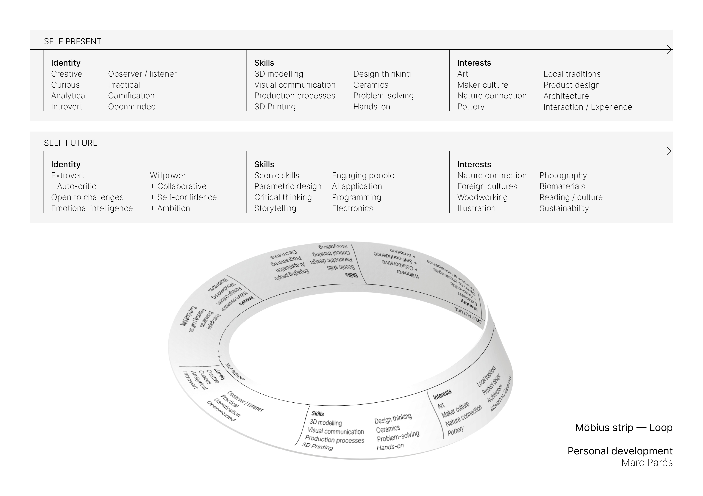

---
hide:
    - toc
---

# Bootcamp

## My Fight

Traditions have always been of great value to society and have created great cultural wealth. Each region has its own, and they have developed and evolved over the years. To keep them alive, they must be transmitted from generation to generation, verbally and in writing, so that their existence will be known in the future, but also through community events where specific techniques and knowledge are taught.

Craftsmanship has been a major thread of local traditions, but with the advent of industrialization, it has been diminished. Ceramics is one of the earliest and most rudimentary production processes that human beings developed. Clay was an abundant, easily mined, and intuitive material to begin experimenting with and modelling objects. They used it to build objects and tools to improve their quality of life and be more efficient. Quickly, techniques were created to work with clay, such as modelling, potter's wheel, molds, extruders, etc., up to one of the most innovative of all, which is 3D printing with clay.

Despite having been discovered millions of years ago, it is still a material with great potential and endless possibilities. From the construction of buildings, thanks to their great ability to resist compression, to a decorative vase that is apparently fragile and brittle. This wide range of possibilities gives this material richness and interest that few others can say the same about. In addition, it is a very useful material that creates an experience during its interaction and brings a process of reflection, patience, and introspection.

Unfortunately, the pace of life that society and everyday life lead us to does not allow us to enjoy these processes of pause and reflection. Social networks, the search for extreme efficiency, and capitalism... take us away from crafts and traditions. However, there are still people, to whom we should be grateful, who still work with crafts, keeping their memories and bringing them closer to modernity, with respect and the will to pass on their knowledge to future generations.

Catalonia has been a very important centre of ceramics, with several towns with a great reputation for the traditions that have been generated around them, such as Breda, Quart, or La Bisbal d'Empordà. The abundant clay soil of much of Catalonia has allowed this craft to develop and be one of the main economic engines of many regions. In addition, the climatic conditions favor the entire ceramic process, allowing suitable drying without requiring additional technologies.

Ceramics is part of the popular culture of many populations, but there are fewer and fewer ceramists who can continue to work and communicate traditional techniques. In [Quart](https://www.ccma.cat/tv3/alacarta/telenoticies-comarques/els-terrissers-de-quart-reclamen-mes-proteccio-de-lofici-que-te-una-tradicio-centenaria/video/6176718/), there are only two potters left who work on ceramics, and it is not because of a lack of work but because young people see more interest in the cities and leave their towns. Therefore, there is a lack of communication about the situation, so a solution would be to promote historical memory with a museum or more pottery training options for new generations.

For all this, this project aims to re-evaluate ceramics, with its traditional techniques, and bring it closer to modern society. Combining craftsmanship with innovative production processes and bringing them to the FabLab concept. The duality of craft and technology, digital crafts, local materials and traditions, gamification, local production and international distribution, co-creation, material development, and biomaterial experimentation are some of the intrinsic concepts of the project.

## Self Development

Reflexion and introspection about who I am now and who I want to be at the end of the master's. A mapping of my self-present, what is my identity, what skills I have and my main interests, and the evolution I wish to have of these three sections. In general, I expect to develop myself personally, to be more open to challenges, and especially more self-confident. 

I used a Möbius Strip to represent my evolution because this shape seems like a current strip but is made with a single surface and it creates a loop. So, inserting my present and future self into this kind of surface represents that the past, present and future are connected and, in my case, what I want to be in the future, my expectations and my auto-critic vision also define my present self.

## Course Expectations

Evaluation of the expectations for every seminar. What I want to learn, the skills I think I will develop, and how I have to approach every seminar to take full advantage of them.

