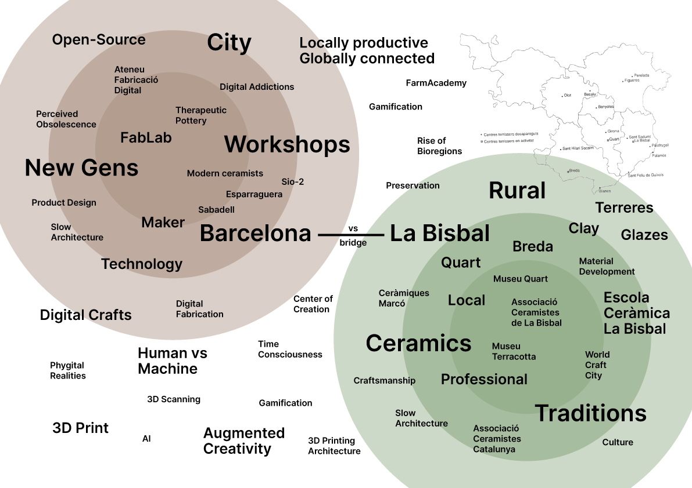

---
hide:
    - toc
---

# Reframing by Reflecting
**Reframing by Reflecting on my project so far**

## My journey

The first term has been a beautiful but hard process where I had to reflect on who I am and who I want to be, professionally but also personally. I positioned fast in the duality of crafts and technology because is a field that I was interested before starting the master and also I already had done some projects.

From this idea I started thinking on ceramics and the local traditions around. Catalonia had an extended culture around pottery and my mother’s family is from La Bisbal, where ceramics has been for a long time the principal motors of economy.

During this term I researched around how

I also found new interests around
-	Ai
-	Technology, Arduino

I struggled with the uncertainty of the design process. Sometimes for me its difficult to be confident in me and believe I am doing things right, so with this term that was about exploring without having an objective I had a lot of ups and downs.

### Learnings
- knowledge about a lot of different fields, opening my mind and my future expectations
- learning to improvise and not knowing were I am going, and growing with all the new inputs
- more open minded, learning about new people, cultures, contexts
- working and learning together (open design process)
- first person perspective design process, becoming one more of the collective

### Design Dialogues
- possible future interventions
- specific ideas for my project, new combinations
- the need to talk to people and make contacts, explaining and communicating my project and ideas without a defined design only with a intention
- referents and new contacts

## Design Space II

<iframe width="100%" height="500" src="https://miro.com/app/live-embed/uXjVPOjb84I=/?moveToViewport=22843,-234,16829,10619&embedId=994993059601" frameborder="0" scrolling="no" allowfullscreen></iframe>
