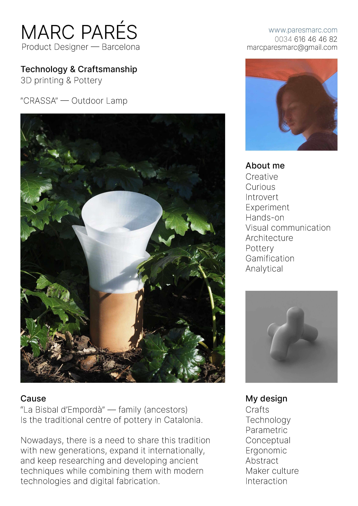

---
hide:
    - toc
---

# My fight

“La Bisbal d’Empordà” — family (ancestors)

Is one of the traditional centres of pottery in Catalonia.
Nowadays, there is a need to share this tradition with new generations, expand it internationally, and keep researching and developing ancient techniques while combining them with modern technologies and digital fabrication.

