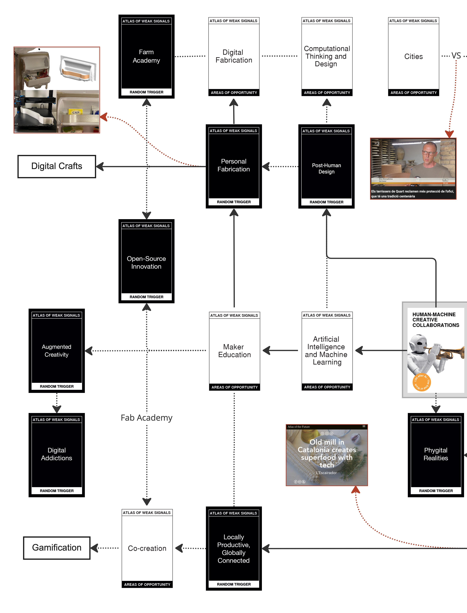
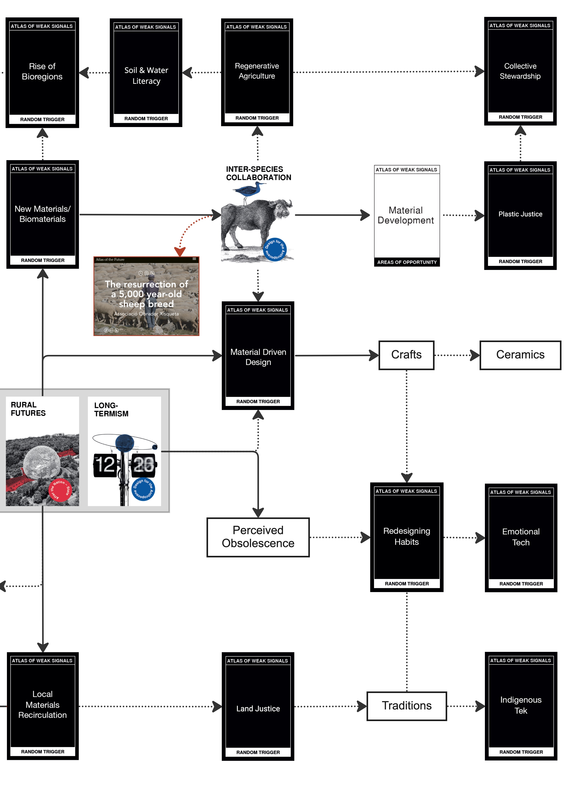

---
hide:
    - toc
---

## Atlas of Weak Signals

The Atlas of Weak Signals is a toolkit to find critical areas to develop a project. A weak signal can be defined as an inflexion point where a problem or a situation can be worked on in the present to become better in the future. Playing and combining weak signals helps to explore new fields while organizing ideas and brainstorming, and is useful for the design process. 

First of all, I selected different cards randomly to get familiar with them and discover new possible fields for our project. This atlas has different categories. First of all, we have the weak signals, separated into five fields: Design for Anthropocene, Life in the Times of Surveillance Capitalism, Kill the Heteropatriarchy, After the Nation-State, and Life after AI - The End of Work, those are the main areas of action. The other types of card are Random Triggers, Areas of Opportunity and Challenges. 

### Weak Signals in The City

We were asked to select one of the cards that interested us for our project and search for an example around the city of Barcelona. I chose Personal Fabrication, a Random Trigger Card that focuses on how in the future the population might have a personal lab to produce their products and be able to repair them when one breaks. People will be the consumers but also the producers of the objects, food, clothes, and all the other necessities in our daily lives. Similar to the kitchens that we have nowadays, we would have a space with new production processes, such as 3D printers, laser machines, CNC cutters, etc.

My images are about a problem that I had in my fridge and a simple solution that I found. One of the shelves had a plastic piece that helped store food, but it broke and it was impossible to fix. The fridge doesn’t have to replace pieces and you cannot buy new ones, so the shelf was useless because the food fell with the movement of the door. So I thought that with 3D printing I would be able to make a simple piece to help organize the food and prevent it from falling. First of all, I scanned the shelf with a 3D Scanner App to obtain the perfect dimensions and abstract shapes. Then I was able to make a 3D model of the piece based on the scanned shelf. After that, I 3D printed it, and once finished, I was able to place it in the fridge, and it fit perfectly.

This is an example of the potential that digital fabrication, personal fabrication, and the revolution of FabLabs have. The users are going to be the consumers but also the producers, so we would be able to fabricate our products personalized and specifically for our context. With this idea, we can repair objects that we would otherwise throw away, generating much less waste.

### Atlas of Weak Signals Map

I started by selecting some Weak Signals for the creation of the project map. The main ones are Rural Futures and Human-Machine Collaborations, because I am interested in this duality between crafts and technology. Another important card is Long-termism. I believe every design has to be long-lasting in terms of material selection, but also the design has to be atemporal in order to prevent the product from becoming outdated. Starting with the Human-Machine Collaborations we can expand to the Fab Lab world, Digital Fabrication, Open-source, AI, etc. All these topics talk about this shift that society has to make to be able to be more sustainable, auto-sufficient, locally regulated and become more collaborative. I believe in Personal Fabrication for the future. I think Industrial Design will change shortly, and everyone will have their own lab or a nearby one to produce their products, or at least to be able to repair and not throw away when something stops working. 

I think this idea of community laboratories with innovative facilities can be merged with traditional craftsmanship and local artisan work. Rural areas are becoming uninhabited, and cities are becoming overcrowded. Craftsmen don’t have new generations to transfer their knowledge, techniques, and traditions. Therefore, Rural Futures must be included in the project, searching for new materials but with special consideration to ceramics, because of my connection but also for the long-time traditions that Catalonia has alongside this material.

So the main point is to help craftsmen expand their work and to have them again as a reference for good design, and to make design promote the union of society. The intersection between Human-Machine Collaborations and Rural Futures can bring new opportunities for artisans to develop their work. With the combination of traditional techniques and innovative ones, we can generate products more attractive and interesting for future generations, revaluing the traditional processes that are getting forgotten. 

### Miro Board

Digital Crafts

Rural and traditions

[Miro Board](https://miro.com/app/board/uXjVPOjb84I=/) - Invitation needed
