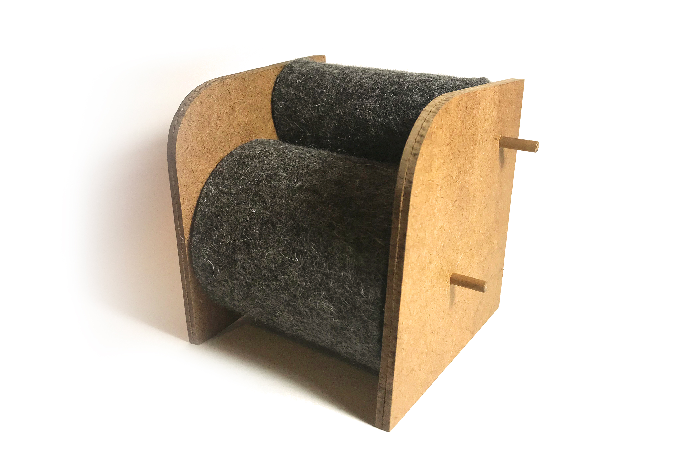
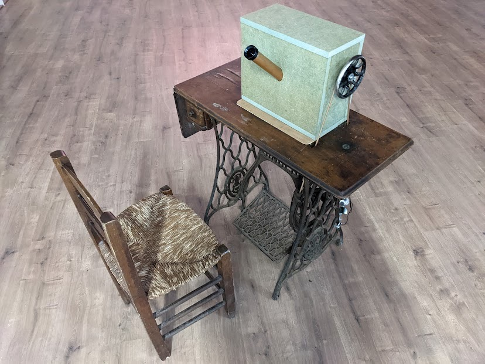
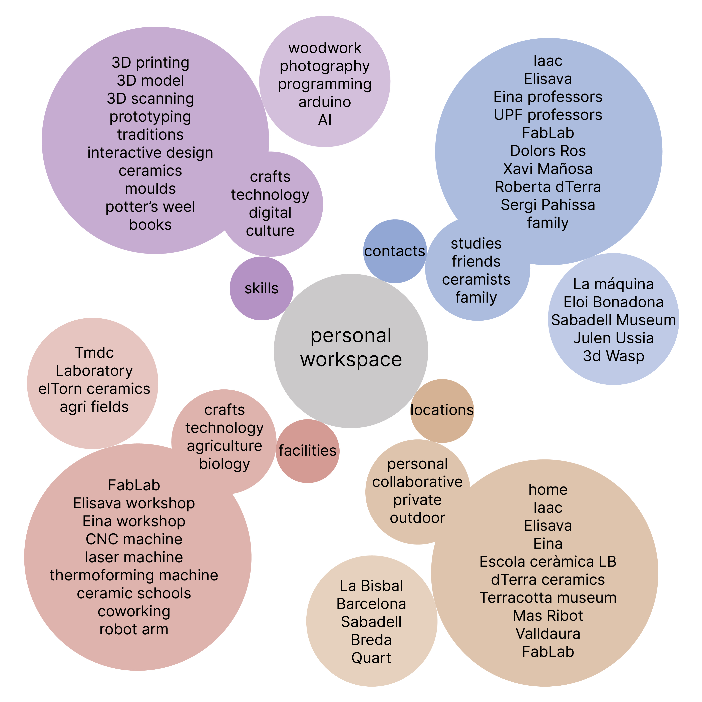

---
hide:
    - toc
---

# Design Studio
## Roles of prototyping

### Role 1: The prototype as an experimental component
The prototype as an experimental component. Prototyping tests an abstract hypothesis. This type searches for body interaction between the user and the product tested. It also looks for an experience, how the user learns how to interact with it, for what is meant and creates a positive experience. Finally aims to show and experiment with some details of the shape such as textures, colours, shadows, physical conditions, etc.

While working on a design project for a chair, I used role 1. Once I had the chair concept, I made a small prototype to see the proportions, the relations between materials, and how the different pieces fit together. This also helped me to test the interaction with the mechanism because I wanted the chair to be adapted to the height of each user. I also looked for gamification concepts to create a playful experience around the chair, so with the first prototype, I could be able to test it and see how it responded. Finally, I was able to extract conclusions about the fixations of the mechanism, so for the final prototype, I could add them.

### Role 2: The prototype as a means of inquiry
The prototype as a means of inquiry where prototypes are developed and deployed as instruments of inquiry to collect, record and measure phenomena.
Explore and understand a phenomenon, situation, or experience to get validation for the final users. Capture information, such as material properties or personal behaviour. Also can provoke a specific situation to collect data on the experience and interaction between the user and the design. Instigate a specific reaction to make the users tell you extreme opinions and situations and get ready for future problems.
Asks how people will use the final product, making statistics and getting results. Time and costs will determine the prototype.

### Role 3: The prototype as a research archetype
The prototype as a research archetype as embodiments of concepts, understandings or design spaces that can be argued to constitute contributions to the discipline. Research archetype to physicalize a specific concept (create multiple examples). Critical and conceptual designs also follow the third role because help you, as a designer, to understand the possibilities. Understand yourself and know what I am capable of, what you can do with your local environment and how materials we have around shape the product.

The third one, I used it in some way while working on a project for Roc Parés, an artist who specializes in interactive communication research. He wanted to develop an analog machine, activated with human energy, that creates a relationship between the user and a water drop. He had this concept, so we needed to design the machine, so we started doing some drawings, 3D models, and renders to conceptualize the design. The [Water Drop Viewer](https://paresmarc.com/waterdropviewer) had the intention of making the user interact with it and create an experience while looking at a drop of water. This piece reflected on the concept of an exhibition “What is possible and what is not”. Through the trial and error of the artistic process, it hopes to make users consider the possibilities of art.

### Role 4: The process of prototyping as a vehicle for inquiry
The process of prototyping as a vehicle for inquiry where the process of making an artefact becomes a qualitative instrumental tool in design research.

The way you prototype is what matters. The process and the experience of prototyping are the reasons for developing the design and a way to bring new ideas to the table. Participatory design, collective thinking, sharing ideas and techniques, co-design, etc. It also helps the users get immersed in the process of design and allows exploration.

This role can be an autobiographical design process where you dialogue with yourself, asking who you are and what you want to achieve. Finally, the documentation of the process is more important than the result. You may write down or film the prototype to preserve your design process in order to be able to replicate it or upgrade it in the future, as well as to share it and make it an open-source project.

## New Workspace

