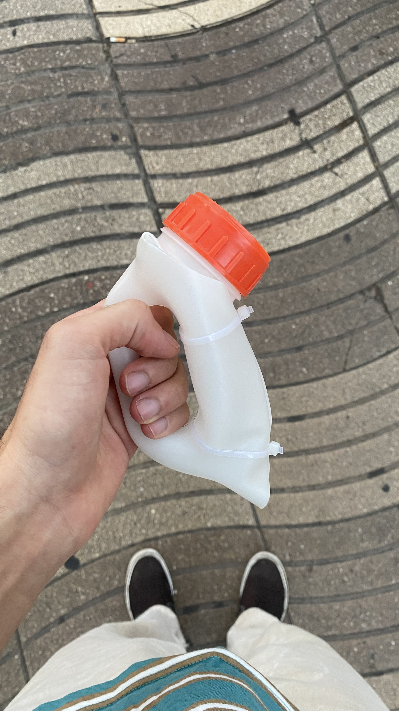
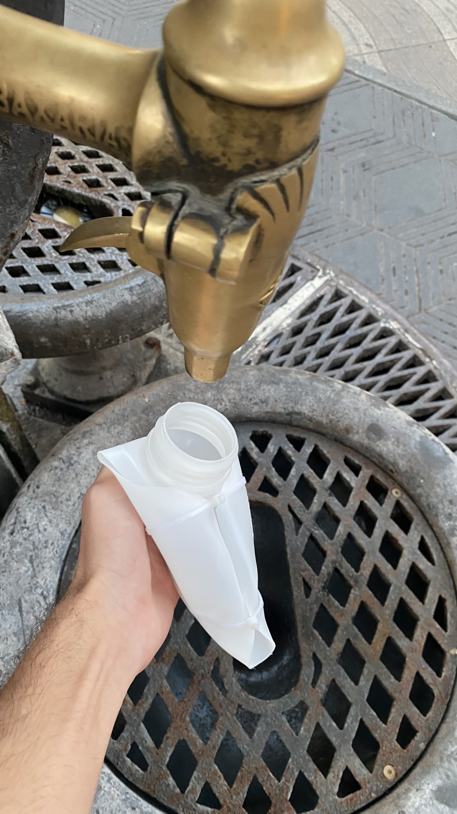

---
hide:
    - toc
---

# Living with your own Ideas
## Make a Copmanion

### Creation and expectations

Ecology:
Reflect about saving water
Capitalism:
The need to have it all
Minimalist lifestyle
— eliminate what is not essential
Minimalism is an antidote to that state of overload
— back to rural places
Bottle that makes you suffer during a day to realize all necessary things and the not essential ones.

### Living with it 24 hours

Living together for 24 hours
how I lived together?
— tried to drink from it (stupid/useless)
— I had to search other ways to get water
what does it notice?
— tried to drink so much times, I realized how much I need water to continue with my life
— I usually drink very little water
why does it matter?
— suffer, feeling humiliated (introspection)
— essential and not essential

### 1PP Exploration

## Experience

## Reflection
