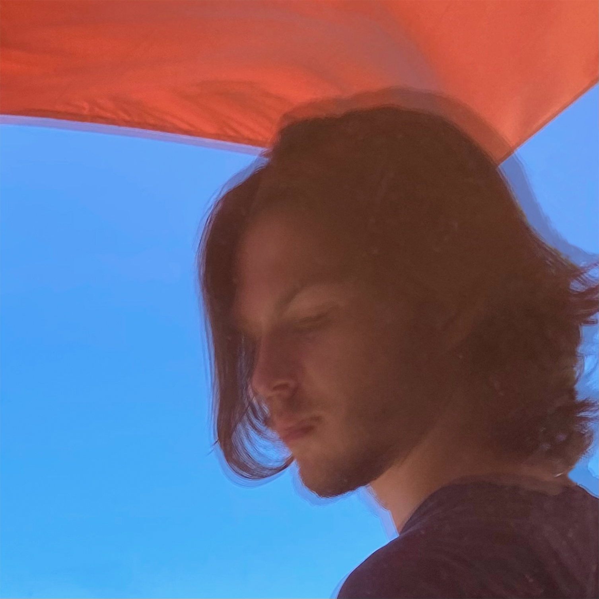

# About

Product designer from Barcelona with the ambition of searching new shapes between technology and crafts.

Materializing his concepts on pieces with a duality of functionality and attraction. His products are defined by eye appeal, ergonomic, tactility and an intrinsic concept.

Currently, interested in local craftsmanship such as ceramics, but also in modern technologies of production such as 3D printing.

Personal Portfolio **[Marc Parés](https://paresmarc.com/)**
